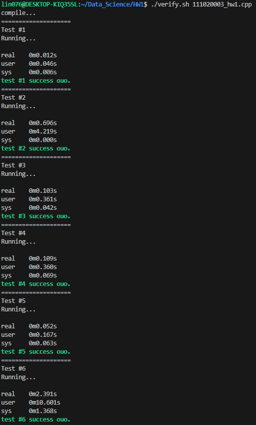
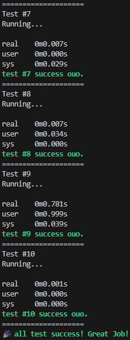

# 作業一
## 開發環境
WSL ( Ubuntu )
## 說明
這裡總共有六個版本的程式實作，分別是:

1. aprior.cpp
2. aprior-eclat.cpp ( 前一個合併下一階集合方法改成搜尋子集相交部分，而非重掃資料集 )
3. aprior-eclat-parallel.cpp ( 前一個進行平行化 )
4. aprior-eclat-parallel-v2.cpp ( 前一個使用 bitset 優化 )
5. 111020003_hw1.cpp ( 前一個把 unordered_map 換成 vector 減少平行化前處理的時間 )
6. eclat.cpp ( 就是 eclat )

基本上是由慢到快排序，也是我寫的順序

然後我有提供測試用的資料，在 verify_data 之下，而助教提供的簡易測試集，我有加進 verify_data 裡面，是第 8 筆資料 ( text_8.txt 跟 ans_8.txt )
最後 Data Science HW1.pptx 是助教的作業說明簡報

附上助教說明影片連結 ( 可能失效 ) : https://youtu.be/7-WWthrhjJ8
## 如何使用我提供的測試用資料集
*免責聲明 : 我不保證過了一定沒問題*

我有寫一個 verify.sh 的 bash 檔案，使用方式如下( 只適用你寫的是C++ )
```bash
./verify.sh [cpp file]
```
你的程式輸入應該要是下面這樣 ( 如果不是的話你再看怎麼改 )
```bash
./[cpp file] [min support] [input file] [output file]
```
這會幫你重新編譯，所以可以直接用就好，然後這也會幫你測試速度，如下方圖片所示





real 是指實際時間，然後 user 是指你調用所有 threads 的執行時間總和，最後 sys 是系統執行 system call 之類的時間 ( 比如說你有平行化程式，那調度多線程就會需要 system call 來處理 )，簡單來說就是 user/real 數值越高代表平行化程度越好，然後比速度是看 real 的時間

如果都對最後會顯示 🎉 <span style="color:#1aff1a"> all test success! Great Job!</span>

有錯誤會顯示 ⚠️ <span style="color:red; font-weight:bold;">some test fail QAQ.</span>

如果你用 python 寫或者沒有平行化處理可能會跑很久 ( 我的測試資料就是隨機生成然後用 mlxtend 的 fp-growth 跑答案的，大約都要跑個一分鐘多才會出答案，而且我的筆電也只是 i5 而已 )

最後，<span style="color:red">**記得裝 python**</span> 因為我會跑 check.py 來驗證輸出是否正確

---

check.py 支援亂序，舉例來說
```
2,3,4:0.2000
1,2,3:0.1500

```
```
3,2,1:0.1500
3,2,4:0.2000

```
上面兩個輸出資料會被視作一樣的輸出

但是支持度的部分我使用字串對比，所以如果你的輸出是 0.2 但驗證答案是 0.2000 這樣你不會過 ( 這是按照作業要求設計的 )

### 已知問題:

由於浮點數誤差比如 0.08965 使用 round(0.08965 * 1e4) / 1e4 後的結果會是 0.0896 而不是 0.0897 我提供的 verify_data 裡的答案都會是 0.0896 受到精度限制的答案，如果你有使用比如說 decimal 去確保精度的話，你可能要自行修改 check.py 或者去自行正確的生成答案 (我的答案是用 python mlxtend 套件生的)

而 check.py 使用方式為下方所示 ( 不過你檔案順序寫反也沒差，反正是比較兩份資料是否相同 )
```bash
./check.py [file to be verified] [answer file]
```
## 其他
這次 C++ 編譯是用下面這指令
```bash
g++ -std=c++2a -pthread -fopenmp -O2 -o [exe_file] [cpp_file]
```
如果後續有改編譯的方式 ( 比如 C++ 版本 )，記得去 verify.sh 裡面改，避免到時出現問題，不會就問 AI 我這腳本也是叫 AI 幫我寫好的 ( 不然我原本都複製貼上 )
